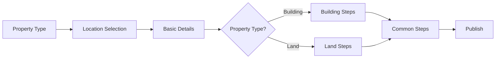

# ListProperty Module - Quick Reference

## 📁 Simplified Structure

```
listProperty/v2/
├── components/
│   ├── PropertyFormPageV2.jsx          # Full page form
│   ├── PropertyFormSheetV2.jsx         # Sheet overlay form
│   ├── PropertyFormSidebar.jsx         # Navigation sidebar
│   ├── StepFormWrapper.jsx             # Step wrapper (simplified)
│   ├── SaveAndContinueFooter.jsx       # Footer navigation
│   ├── shared/
│   │   ├── FormField.jsx               # 🆕 Reusable form field
│   │   └── ProTipV2.jsx
│   └── steps/                          # 15 step components
├── config/
│   └── stepConfiguration.js            # ✨ Simplified (344→100 lines)
├── context/
│   └── PropertyFormContextV2.jsx       # ✨ Simplified (308→150 lines)
├── hooks/
│   └── usePropertyPublish.js           # 🆕 Publishing logic hook
└── index.js
```

---

## 🎯 Core Files

### 1. PropertyFormContextV2.jsx
**Purpose:** Central state management for the multi-step form

**Key State:**
- `currentStep` - Active step index
- `propertyType` - Selected property type
- `formData` - Accumulated form data
- `completedSteps` - Set of completed step indices
- `draftId` - Current draft ID
- `isLoading` - Single loading state

**Key Functions:**
```js
saveAndContinue(stepData)  // Save step & move to next
previousStep()              // Go back one step
goToStep(index)            // Jump to specific step
saveDraft(data)            // Save to backend
resetForm()                // Clear all data
```

---

### 2. stepConfiguration.js
**Purpose:** Define and control step visibility

**Structure:**
```js
STEP_CONFIG = [
  {
    id: 'property-type',
    name: 'Property Type',
    component: PropertyTypeStepV2,
    isVisible: (data) => true
  },
  // ... more steps
]
```

**Helper Functions:**
```js
getVisibleSteps(formData)           // Get currently visible steps
getStepComponent(index, formData)   // Get component by index
getTotalVisibleSteps(formData)      // Count visible steps
```

**Property Type Checks:**
```js
isBuilding(type)   // apartment, villa, duplex, etc.
isLand(type)       // plot, farmhouse, agricultural_land
isApartment(type)  // apartment, penthouse
```

---

### 3. usePropertyPublish Hook
**Purpose:** Handle property publishing logic

**Usage:**
```jsx
const { publish, isPublishing } = usePropertyPublish(draftId, formData);

// Publish property
await publish();
```

**Features:**
- Auto-sanitizes form data
- Toast notifications
- Error handling
- Loading state management

---

## 🔧 Common Patterns

### Creating a New Step

```jsx
import { useForm } from 'react-hook-form';
import { zodResolver } from '@hookform/resolvers/zod';
import { usePropertyFormV2 } from '../../context/PropertyFormContextV2';
import SaveAndContinueFooter from '../SaveAndContinueFooter';
import FormField from '../shared/FormField';
import myStepSchema from '../../../schemas/myStepSchema';

export default function MyStepV2() {
  const { saveAndContinue, previousStep, formData } = usePropertyFormV2();

  const form = useForm({
    resolver: zodResolver(myStepSchema),
    defaultValues: {
      myField: formData?.myField || '',
    },
  });

  const onSubmit = async (data) => {
    await saveAndContinue(data);
  };

  return (
    <form onSubmit={form.handleSubmit(onSubmit)} className="space-y-6">
      <div className="bg-white rounded-lg shadow-sm p-6">
        <h3 className="text-lg font-semibold mb-4">My Step Title</h3>
        
        <FormField
          name="myField"
          label="My Field Label"
          control={form.control}
          error={form.formState.errors.myField}
          placeholder="Enter value..."
        />
      </div>

      <SaveAndContinueFooter
        onBack={previousStep}
        onSaveAndContinue={form.handleSubmit(onSubmit)}
      />
    </form>
  );
}
```

### Adding Step to Configuration

```js
// In stepConfiguration.js
{
  id: 'my-step',
  name: 'My Step',
  component: MyStepV2,
  isVisible: (data) => !!data.propertyType,
}
```

---

## 📝 Using FormField Component

### Text Input
```jsx
<FormField
  name="propertyName"
  label="Property Name"
  control={form.control}
  error={form.formState.errors.propertyName}
  placeholder="Enter property name"
/>
```

### Select Dropdown
```jsx
<FormField
  name="propertyType"
  label="Property Type"
  type="select"
  control={form.control}
  error={form.formState.errors.propertyType}
  options={[
    { value: 'apartment', label: 'Apartment' },
    { value: 'villa', label: 'Villa' },
  ]}
/>
```

### Textarea
```jsx
<FormField
  name="description"
  label="Description"
  type="textarea"
  rows={5}
  control={form.control}
  error={form.formState.errors.description}
  placeholder="Describe your property..."
/>
```

---

## 🎨 Step Visibility Rules

| Property Type | Visible Steps |
|--------------|---------------|
| **Buildings** (apartment, villa, etc.) | Basic Config, Furnishing, Location Attrs, Pricing, Suitable For (rent only), Listing, Amenities, Media, Plans, Documents |
| **Apartments** (apartment, penthouse) | All Building steps + Floor Details |
| **Land** (plot, farmhouse) | Land Attributes, Pricing, Listing, Amenities, Media, Plans, Documents |

---

## 🔄 Form Flow



---

## 💡 Best Practices

### ✅ Do:
- Use `FormField` for consistent form inputs
- Call `saveAndContinue()` when step is complete
- Use property type checks from `stepConfiguration.js`
- Keep step components focused and simple
- Add Zod schema validation for each step

### ❌ Don't:
- Don't manage draft saving manually (context handles it)
- Don't duplicate auto-save logic in steps
- Don't call API directly from steps (use context/hooks)
- Don't add steps without visibility rules
- Don't forget to add defaultValues from `formData`

---

## 🐛 Debugging Tips

### Check Current State
```jsx
const context = usePropertyFormV2();
console.log('Current state:', {
  step: context.currentStep,
  propertyType: context.propertyType,
  draftId: context.draftId,
  formData: context.formData,
  completed: Array.from(context.completedSteps),
});
```

### Verify Step Visibility
```jsx
import { getVisibleSteps } from '../config/stepConfiguration';

const visibleSteps = getVisibleSteps(formData);
console.log('Visible steps:', visibleSteps.map(s => s.name));
```

### Test Draft Save
```jsx
const { saveDraft } = usePropertyFormV2();

const testSave = async () => {
  const result = await saveDraft({ test: 'data' });
  console.log('Save result:', result);
};
```

---

## 📊 Performance

### Before Simplification:
- Context: 308 lines
- Step Config: 344 lines
- StepWrapper: 182 lines
- **Total: 834 lines**

### After Simplification:
- Context: ~150 lines (-51%)
- Step Config: ~100 lines (-71%)
- StepWrapper: ~100 lines (-45%)
- **Total: ~350 lines (-58%)**

### Benefits:
- ⚡ Faster rendering (less state updates)
- 🧠 Easier to understand
- 🛠️ Simpler to maintain
- 🐛 Fewer potential bugs
- 📦 Smaller bundle size

---

## 🚀 Quick Start

### Use in Page
```jsx
import { PropertyFormPageV2 } from '@/modules/listProperty/v2';

// Route: /list-property/:draftId
<Route path="/list-property/:draftId?" element={<PropertyFormPageV2 />} />
```

### Use in Sheet
```jsx
import { PropertyFormSheetV2 } from '@/modules/listProperty/v2';

const [open, setOpen] = useState(false);

<PropertyFormSheetV2 
  open={open} 
  onOpenChange={setOpen}
  initialDraftId="draft-123" // optional
/>
```

---

## 📞 Support

For issues or questions:
1. Check [SIMPLIFICATION_SUMMARY.md](./SIMPLIFICATION_SUMMARY.md)
2. Review step component examples in `/components/steps/`
3. Check context API in `PropertyFormContextV2.jsx`
4. Review step configuration in `stepConfiguration.js`
